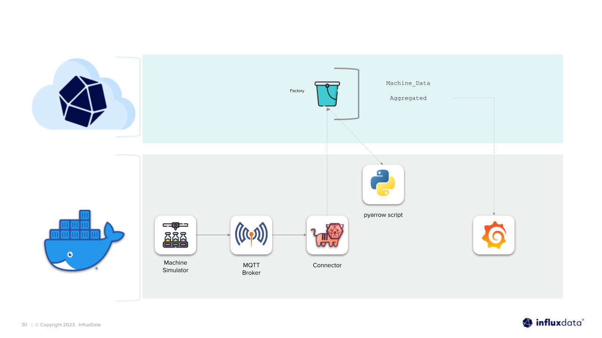

# Arrow Task Engine

This example tutorial shows you how to build a simple task engine using Arrow, docker and an analytics library called ["Anomaly Detection Tool Kit"](https://adtk.readthedocs.io/en/stable/).

## Architecture


## Setup
Please make sure you have the following prerequisites before you begin:
- [Docker](https://docs.docker.com/get-docker/)
- [InfluxDB IOx](https://github.com/InfluxCommunity/InfluxDB-IOx-Quick-Starts#influxdb-iox)
- [Env file](https://github.com/InfluxCommunity/InfluxDB-IOx-Quick-Starts#env-file)
- [Grafana flighsql plugin](https://github.com/InfluxCommunity/InfluxDB-IOx-Quick-Starts#grafana-flighsql-plugin)

### InfluxDB IOx
To get started, you will need to create an InfluxDB IOx account. If you don't already have an account, you can sign up for free [here](https://cloud2.influxdata.com/signup). Once you have an account, you can create a new organization and bucket to store your data. You can find instructions on how to do this [here](https://docs.influxdata.com/influxdb/cloud/organizations/buckets/create-bucket/).

### Env file
To connect Grafana to InfluxDB IOx, you will need to create an env file. With the top directory create a file called `.env`:
```bash
touch .env
```
This file will contain the following information:
```
export INFLUX_HOST=
export INFLUX_TOKEN=
export INFLUX_ORG=
export INFLUX_BUCKET=
```
**Note: make sure to specify your `INFLUX_HOST` without the protocal like so: `us-east-1-1.aws.cloud2.influxdata.com`**

### Grafana flighsql plugin
To connect Grafana to InfluxDB IOx, you will need to install the Grafana flighsql plugin. To do this follow these instructions [here](https://docs.influxdata.com/influxdb/cloud-iox/visualize-data/grafana/).

Once you have downloaded the plugin, unzip the folder and copy the `influxdata-flightsql-datasource` directory to the `plugins` directory in the top directory of this repository.

## Run
To run, make sure to first source the env file:
```bash
source .env
```
Navigate to the quick start you would like to run and run the following command:
```bash
docker-compose up -d
```
This will start Grafana server and Telegraf. Once the quick start is running, you can access Grafana at `localhost:3000`. You can log in with the default username and password: `admin` and `admin`.
